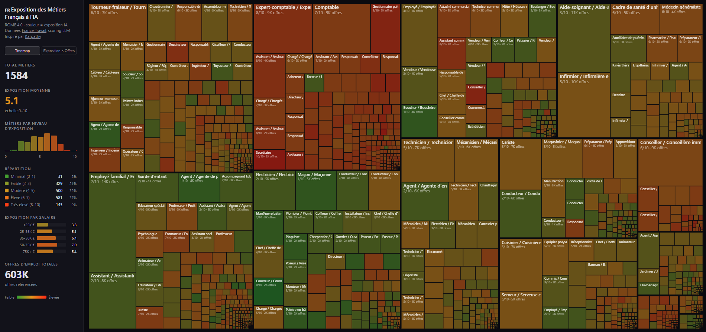

# 🇫🇷 Exposition des Métiers Français à l'IA

Analyse de l'exposition de chaque métier de l'économie française à l'intelligence artificielle, à partir des données [France Travail](https://francetravail.io/data/api) (référentiel ROME 4.0) et du Baromètre des Métiers en Tension (BMO).

Inspiré par le projet [karpathy.ai/jobs](https://karpathy.ai/jobs/).

Déployé sur [fascinax.github.io/jobsfr](https://fascinax.github.io/jobsfr/).


## Ce que contient ce dépôt

Le référentiel ROME 4.0 couvre **1 584 métiers** couvrant tous les secteurs de l'économie française, avec des données sur les offres d'emploi, les projets de recrutement, les difficultés de recrutement, et les compétences associées. Chaque métier est scoré par un LLM pour son exposition à l'IA, et visualisé dans une treemap interactive.

## Pipeline de données

1. **Fetch ROME** (`fr/fetch_rome.py`) — Télécharge la liste des métiers depuis l'API France Travail (référentiel ROME 4.0) dans `fr/data/occupations.json`.
2. **Fetch données marché** (`fr/fetch_market_data.py`) — Récupère les offres d'emploi actives par métier depuis l'API France Travail.
3. **Fetch BMO** (`fr/fetch_bmo.py`) — Récupère les projections de recrutement et taux de difficulté depuis le Baromètre des Métiers en Tension.
4. **Score IA** (`fr/score_fr.py`) — Envoie chaque métier à un LLM (Google Gemini Flash via OpenRouter) avec une rubrique de scoring. Chaque métier reçoit un score d'exposition IA de 0 à 10 avec un raisonnement. Résultats sauvegardés en shards dans `fr/data/scores_shards/` puis fusionnés dans `fr/data/scores.json`.
5. **Build CSV** (`fr/make_csv_fr.py`) — Fusionne toutes les données en `fr/data/occupations_fr.csv`.
6. **Build site** (`fr/build_site_data_fr.py`) — Prépare `fr/site/data.json` pour le frontend.
7. **Website** (`fr/site/index.html`) — Treemap interactive : surface = nb offres d'emploi, couleur = exposition IA (vert → rouge).

## Fichiers clés

| Fichier | Description |
|---------|-------------|
| `fr/data/occupations.json` | Liste des 1 584 métiers ROME 4.0 (titre, code ROME, slug) |
| `fr/data/scores.json` | Scores d'exposition IA (0–10) + raisonnement pour chaque métier |
| `fr/data/occupations_fr.csv` | Données complètes : offres, BMO, scores, compétences |
| `fr/data/scores_shards/` | Shards de scoring (traitement parallèle par plages d'indices) |
| `fr/pages/` | Pages Markdown par métier |
| `fr/site/` | Site statique (treemap + page d'analyse) |
| `fr/prompt_fr.md` | Toutes les données en un seul fichier, pour analyse LLM |
| `openrouter_sdk_client.py` | Client OpenRouter (Gemini Flash) pour le scoring |

## Scoring de l'exposition IA

Chaque métier est scoré sur un axe unique **Exposition IA** de 0 à 10, mesurant dans quelle mesure l'IA va transformer ce métier. Le score prend en compte l'automatisation directe (l'IA fait le travail) et les effets indirects (l'IA rend les travailleurs tellement productifs que moins sont nécessaires).

Le signal clé est de savoir si le travail est fondamentalement digital — si le métier peut être exercé entièrement depuis un ordinateur, l'exposition est intrinsèquement élevée. À l'inverse, les métiers nécessitant une présence physique, des compétences manuelles ou une interaction humaine en temps réel ont une barrière naturelle.

**Exemples de calibration :**

| Score | Signification | Exemples |
|-------|--------------|---------|
| 0–1 | Minimale | Couvreur, maçon, pêcheur |
| 2–3 | Faible | Électricien, aide-soignant, conducteur PL |
| 4–5 | Modérée | Infirmier, vendeur, technicien |
| 6–7 | Élevée | Enseignant, manager, ingénieur, journaliste |
| 8–9 | Très élevée | Développeur web, gestionnaire paie, data analyst |
| 10 | Maximum | Opérateur de saisie, secrétaire |

Exposition moyenne sur l'ensemble des 1 584 métiers : **5,06/10**.

## Visualisation

La visualisation principale est une **treemap interactive** (`fr/site/index.html`) où :
- La **surface** de chaque rectangle est proportionnelle au nombre d'offres d'emploi
- La **couleur** indique l'exposition IA (vert = faible, rouge = élevée)
- Le **survol** affiche un tooltip avec offres, projets BMO, taux de difficulté, score et raisonnement LLM

## Prérequis

```bash
# Copier et remplir les variables d'environnement
cp .env.example .env

# Installer les dépendances
uv sync
```

Variables nécessaires dans `.env` :
- `OPENROUTER_API_KEY` — clé API OpenRouter (pour le scoring LLM)
- `FRANCE_TRAVAIL_CLIENT_ID` / `FRANCE_TRAVAIL_CLIENT_SECRET` — accès API France Travail

## LLM prompt

[`prompt.md`](prompt.md) packages all the data — aggregate statistics, tier breakdowns, exposure by pay/education, BLS growth projections, and all 342 occupations with their scores and rationales — into a single file (~45K tokens) designed to be pasted into an LLM. This lets you have a data-grounded conversation about AI's impact on the job market without needing to run any code. Regenerate it with `uv run python make_prompt.py`.

## Setup

```
uv sync
uv run playwright install chromium
```

Requires GitHub Copilot authentication in `.env` (or `gh auth login`):
```
GITHUB_PAT=your_github_pat_with_copilot_scope
```

## Usage

```bash
# Scrape BLS pages (only needed once, results are cached in html/)
uv run python scrape.py

# Generate Markdown from HTML
uv run python process.py

# Generate CSV summary
uv run python make_csv.py

# Score AI exposure (uses Copilot SDK)
uv run python score.py

# Build website data
uv run python build_site_data.py

# Serve the site locally
cd site && python -m http.server 8000
```
